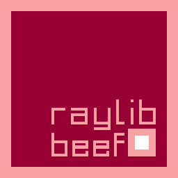

# Raylib-Beef
**raylib-beef** is a Beef wrapper library for **Raylib 3.1 dev**, a simple and easy-to-use library. In combination with benefits of Beef programming language, making games is pure satisfaction!

> **Attention!** This binding is still in development. Bugs may occur.
	Binaries are removed from repo. You can download this library with binaries from [Release page](https://github.com/M0n7y5/raylib-beef/releases)!

## What is done
- Bindings for:
    - raylib.h
    - raymath.h 
    - rlgl.h (partly)
	- Physac.h - *Warning! Symbols are not included in released binary!*
	- Easings.h

## Important notes
- there are no bindings for text manipulating methods
	- Beef already has custom methods for text manupulation
-  rlgl bindings are partly done
- library is statically compiled with **/MT** flag

## TODO:
- Make bindings for other header files:
    - raygui.h
- Rewrite examples to Beef
- Make higher abstraction for raylib-beef (RayApp)(??)


# Quick Start *(using Beef IDE)*
1. **Download** raylib-beef and copy it here: **C:\Program Files\BeefLang\BeefLibs**
2. Right-click on your workspace and select **Add from Installed** and choose raylib-beef
3. **Make** raylib-beef **as a dependency** of your project 
4. Write some code:
```csharp
using System;
using static raylib_beef.Raylib;
namespace YOUR_NAMESPACE_HERE
{
	class Program
	{
		public static int Main(String[] args)
		{
			let text = scope String("Hello from Beef! Hope you have a good day!");

			SetConfigFlags(.FLAG_WINDOW_RESIZABLE);
			InitWindow(800, 600, "Hello world");
			SetTargetFPS(60);

			while (!WindowShouldClose())
			{
				BeginDrawing();

				ClearBackground(.(52, 52, 52, 255));

				var x = (GetScreenWidth() / 2) - (MeasureText(text, 35) / 2);
				var y = GetScreenHeight() / 2;

				DrawText(text, x, y, 35, .LIGHTGRAY);

				EndDrawing();
			}

			CloseWindow();
			return 0;
		}
	}
}
```
5. Profit!

# More Info
- More info about **raylib** (https://github.com/raysan5/raylib)
- More info about **BeefLang** (https://www.beeflang.org)

# Contribution

I'll be glad for any contribution & pull requests
