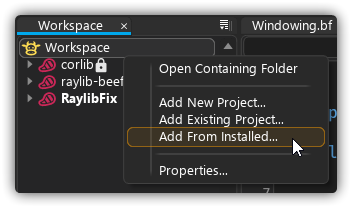
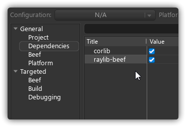
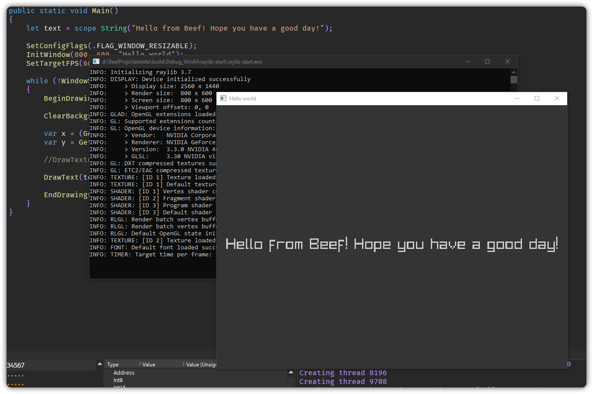
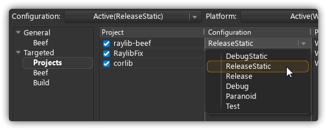
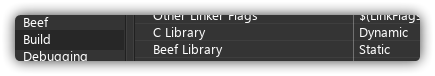

# Raylib-Beef


**raylib-beef** is a Beef wrapper library for **Raylib 3.7**, a simple and easy-to-use library. In combination with the benefits of the Beef programming language, making games is pure satisfaction!

> **Attention!** These bindings are still in development. Bugs may occur.
	You can download this library with binaries from the [Release page](https://github.com/M0n7y5/raylib-beef/releases)!

> **OS Support** is limited to Windows right now. I am only able test this library on Windows at the moment.

<br>
<br>

---

## What is done
- Bindings for:
    - raylib.h
    - raymath.h 
    - rlgl.h (partly)
	- Easings.h

## Important notes
- there are no bindings for text manipulating methods
	- Beef already has custom methods for text manupulation
-  rlgl bindings are **partly done**

## TODO:
- Rewrite examples in Beef
- finish rlgl.h bindings

# Quick Start *(using Beef IDE)*
1. **Download** raylib-beef.zip **FROM RELEASE PAGE** and extract raylib-beef folder from that zip file to: **C:\Program Files\BeefLang\BeefLibs**
2. Right-click on your workspace and select **Add from Installed** and choose raylib-beef



3. **Add** raylib-beef **as a dependency** of your project




4. Write some code:
```csharp
using System;
using static raylib_beef.Raylib;

namespace YOUR_NAMESPACE_HERE
{
	class Program
	{
		public static int Main(String[] args)
		{
			let text = "Hello from Beef! Hope you have a good day!";

			SetConfigFlags(.FLAG_WINDOW_RESIZABLE);
			InitWindow(800, 600, "Hello world");
			SetTargetFPS(60);

			while (!WindowShouldClose())
			{
				BeginDrawing();

				ClearBackground(.(52, 52, 52, 255));

				var x = (GetScreenWidth() / 2) - (MeasureText(text, 35) / 2);
				var y = GetScreenHeight() / 2;

				DrawText(text, x, y, 35, .LIGHTGRAY);

				EndDrawing();
			}

			CloseWindow();
			return 0;
		}
	}
}
```
5. Profit!

<center>



</center>

## Static linking
By default linking is set to dynamically link to Raylib. You can change that by selecting different raylib-beef **project configuration** in **Workspace** settings. You can select from **DebugStatic** and **ReleaseStatic**.



Then **set** your app project **build properties** to this:



# More Examples
https://github.com/DerTee/raylib-beef-examples

# More Info
- More info about **raylib** (https://github.com/raysan5/raylib)
- More info about **BeefLang** (https://www.beeflang.org)

# Contribution

I'll be glad for any reported issues & pull requests

## Notes
- any contributions apart from bugfixes need to be placed in `src/Extensions`
	- this will separate additional helper functions from bindings
	- for example if you want to add some cool method for **Vector3**, you will create **Vector3.&#xfeff;bf** in `src/Extensions/Types` and add that cool method to existing Vector3 type by using [extensions](https://www.beeflang.org/docs/language-guide/datatypes/extensions/) statement
